# Smart Alert Dismissal: Design Specification

**Version:** 1.0
**Date:** September 2025
**Status:** Design & Acceptance Criteria
**Impact:** Low - localStorage/client-side only, no backend changes
**Effort:** 2 days development

---

## Problem Statement

### Current Behavior: "Dismiss Forever"

```typescript
// Current implementation (simplified)
const dismissAlert = (alertId: string) => {
  const dismissed = new Set(localStorage.get('dismissed'))
  dismissed.add(alertId)
  localStorage.set('dismissed', Array.from(dismissed))
  // Alert never shows again until manually restored
}
```

**Issues:**
1. **No memory of conditions** - System doesn't remember *why* alert was dismissed
2. **Manual restoration only** - User must actively click "Restore hidden alerts"
3. **Worsening conditions ignored** - Deficit increases from 5 to 50, alert stays hidden
4. **Time-based staleness** - Dismissed 6 months ago, still hidden today

**Real-World Example:**
- Nov 1: "Need 5 serum kits" → Coordinator dismisses (already aware, vendor order pending)
- Nov 15: Vendor shipment delayed, deficit increases to 15
- Nov 20: Critical shortage, but alert still hidden
- Result: Study coordinator unaware until urgent shortage impacts visits

---

## Proposed Solution: Condition-Based Auto-Restore

### Core Principle
**Dismissal = "I acknowledge this issue at its current severity"**

If conditions significantly worsen, auto-restore the alert to grab attention again.

---

## Alert Dismissal Data Model

### Current Model
```typescript
// localStorage: dismissed-alerts
["deficit-serum-kit", "expiring-urine-kit", "pending-aging-quest"]
```
**Problem:** No context about when or why dismissed

### New Model
```typescript
interface DismissalRecord {
  alertId: string                    // Unique identifier
  dismissedAt: string                // ISO timestamp
  dismissedBy: string | null         // User ID (optional)
  conditions: AlertConditions        // State at dismissal time
  autoRestoreRules: RestoreRule[]    // How to auto-restore
  manuallyRestored: boolean          // User clicked "Restore"
}

interface AlertConditions {
  // For deficit alerts
  deficit?: number
  kitsRequired?: number
  kitsAvailable?: number

  // For expiring alerts
  kitsExpiringSoon?: number
  earliestExpiryDate?: string

  // For order/shipment alerts
  daysAging?: number
  orderQuantity?: number
}

interface RestoreRule {
  type: 'threshold' | 'percentage' | 'time' | 'status_change'
  field: keyof AlertConditions
  operator: '>' | '<' | '>=' | '<=' | '==' | '!='
  value: number | string
  description: string
}
```

**Example:**
```typescript
{
  alertId: "deficit-serum-kit-uuid",
  dismissedAt: "2025-11-01T10:30:00Z",
  dismissedBy: "user-uuid",
  conditions: {
    deficit: 5,
    kitsRequired: 15,
    kitsAvailable: 10
  },
  autoRestoreRules: [
    {
      type: "percentage",
      field: "deficit",
      operator: ">=",
      value: 1.5,
      description: "Deficit increased by 50%"
    },
    {
      type: "time",
      field: "dismissedAt",
      operator: ">=",
      value: 7,
      description: "7 days have passed"
    }
  ],
  manuallyRestored: false
}
```

---

## Auto-Restore Rules by Alert Type

### 1. Supply Deficit Alerts

**Alert Type:** `deficit-{kitTypeId}`

**Dismissal Snapshot:**
```typescript
{
  deficit: number
  kitsRequired: number
  kitsAvailable: number
  daysUntilFirstVisit: number
}
```

**Auto-Restore Rules:**
```typescript
const deficitRules: RestoreRule[] = [
  {
    type: 'percentage',
    field: 'deficit',
    operator: '>=',
    value: 1.5, // 50% increase
    description: 'Deficit increased by 50% or more'
  },
  {
    type: 'threshold',
    field: 'deficit',
    operator: '>=',
    value: 10, // Absolute threshold
    description: 'Deficit now exceeds 10 kits (critical level)'
  },
  {
    type: 'time',
    field: 'dismissedAt',
    operator: '>=',
    value: 7, // days
    description: '7 days have passed since dismissal'
  },
  {
    type: 'threshold',
    field: 'daysUntilFirstVisit',
    operator: '<=',
    value: 3, // days
    description: 'Visit requiring kits is now within 3 days'
  }
]
```

**Example Evaluation:**
```typescript
const dismissed = {
  alertId: 'deficit-serum',
  dismissedAt: '2025-11-01T10:00:00Z',
  conditions: { deficit: 5, kitsRequired: 15, kitsAvailable: 10, daysUntilFirstVisit: 14 }
}

const current = {
  deficit: 8, // Increased 60% (5 → 8)
  kitsRequired: 18,
  kitsAvailable: 10,
  daysUntilFirstVisit: 7
}

// Check rules
const shouldRestore =
  (current.deficit >= dismissed.conditions.deficit * 1.5) || // TRUE (8 >= 7.5)
  (current.deficit >= 10) || // FALSE
  (daysSince(dismissed.dismissedAt) >= 7) || // FALSE (6 days)
  (current.daysUntilFirstVisit <= 3) // FALSE

// Result: RESTORE (first rule triggered)
```

---

### 2. Expiring Soon Alerts

**Alert Type:** `expiring-{kitTypeId}`

**Dismissal Snapshot:**
```typescript
{
  kitsExpiringSoon: number
  earliestExpiryDate: string
  totalAvailable: number
}
```

**Auto-Restore Rules:**
```typescript
const expiringRules: RestoreRule[] = [
  {
    type: 'threshold',
    field: 'kitsExpiringSoon',
    operator: '>=',
    value: 2, // Multiplier
    description: 'Number of expiring kits doubled'
  },
  {
    type: 'time',
    field: 'dismissedAt',
    operator: '>=',
    value: 14, // days
    description: '14 days have passed'
  },
  {
    type: 'threshold',
    field: 'earliestExpiryDate',
    operator: '<=',
    value: 7, // days from now
    description: 'Earliest expiry now within 7 days'
  }
]
```

---

### 3. Pending Order Aging Alerts

**Alert Type:** `pending-aging-{orderId}`

**Dismissal Snapshot:**
```typescript
{
  daysAging: number
  orderQuantity: number
  vendor: string
  expectedArrival: string
}
```

**Auto-Restore Rules:**
```typescript
const orderAgingRules: RestoreRule[] = [
  {
    type: 'threshold',
    field: 'daysAging',
    operator: '>=',
    value: 14, // Absolute threshold
    description: 'Order now 14+ days old (critical)'
  },
  {
    type: 'time',
    field: 'dismissedAt',
    operator: '>=',
    value: 7,
    description: '7 days have passed'
  },
  {
    type: 'status_change',
    field: 'status',
    operator: '==',
    value: 'overdue',
    description: 'Order is now overdue'
  }
]
```

---

### 4. Shipment Stuck Alerts

**Alert Type:** `shipment-stuck-{shipmentId}`

**Dismissal Snapshot:**
```typescript
{
  daysSinceShipped: number
  trackingNumber: string
  destination: string
}
```

**Auto-Restore Rules:**
```typescript
const shipmentStuckRules: RestoreRule[] = [
  {
    type: 'threshold',
    field: 'daysSinceShipped',
    operator: '>=',
    value: 10, // Absolute threshold
    description: 'Shipment now 10+ days in transit'
  },
  {
    type: 'time',
    field: 'dismissedAt',
    operator: '>=',
    value: 3,
    description: '3 days have passed'
  }
]
```

---

### 5. Low Buffer Warning Alerts

**Alert Type:** `low-buffer-{kitTypeId}`

**Dismissal Snapshot:**
```typescript
{
  currentBuffer: number // days of coverage
  recommendedBuffer: number
  bufferPercentage: number // current/recommended
}
```

**Auto-Restore Rules:**
```typescript
const lowBufferRules: RestoreRule[] = [
  {
    type: 'percentage',
    field: 'bufferPercentage',
    operator: '<=',
    value: 0.25, // 25% or less of recommended
    description: 'Buffer dropped below 25% of recommended'
  },
  {
    type: 'time',
    field: 'dismissedAt',
    operator: '>=',
    value: 14,
    description: '14 days have passed'
  }
]
```

---

## Implementation

### Core Functions

```typescript
// 1. Save dismissal with context
function dismissAlertWithContext(
  alertId: string,
  currentConditions: AlertConditions,
  rules: RestoreRule[]
): void {
  const dismissalRecord: DismissalRecord = {
    alertId,
    dismissedAt: new Date().toISOString(),
    dismissedBy: getCurrentUserId(),
    conditions: currentConditions,
    autoRestoreRules: rules,
    manuallyRestored: false
  }

  const allDismissals = getDismissalRecords()
  allDismissals.set(alertId, dismissalRecord)
  saveDismissalRecords(allDismissals)
}

// 2. Check if alert should be restored
function shouldAutoRestore(
  dismissal: DismissalRecord,
  currentConditions: AlertConditions
): { shouldRestore: boolean; reason: string | null } {
  for (const rule of dismissal.autoRestoreRules) {
    const triggered = evaluateRule(rule, dismissal.conditions, currentConditions)
    if (triggered) {
      return { shouldRestore: true, reason: rule.description }
    }
  }
  return { shouldRestore: false, reason: null }
}

// 3. Evaluate individual rule
function evaluateRule(
  rule: RestoreRule,
  dismissedConditions: AlertConditions,
  currentConditions: AlertConditions
): boolean {
  if (rule.type === 'percentage') {
    const dismissedValue = dismissedConditions[rule.field] as number
    const currentValue = currentConditions[rule.field] as number
    const threshold = dismissedValue * (rule.value as number)

    switch (rule.operator) {
      case '>=': return currentValue >= threshold
      case '<=': return currentValue <= threshold
      case '>': return currentValue > threshold
      case '<': return currentValue < threshold
      default: return false
    }
  }

  if (rule.type === 'threshold') {
    const currentValue = currentConditions[rule.field] as number
    const threshold = rule.value as number

    switch (rule.operator) {
      case '>=': return currentValue >= threshold
      case '<=': return currentValue <= threshold
      case '>': return currentValue > threshold
      case '<': return currentValue < threshold
      case '==': return currentValue === threshold
      case '!=': return currentValue !== threshold
      default: return false
    }
  }

  if (rule.type === 'time') {
    const dismissedAt = new Date(dismissal.dismissedAt)
    const now = new Date()
    const daysSince = Math.floor((now.getTime() - dismissedAt.getTime()) / (1000 * 60 * 60 * 24))

    return daysSince >= (rule.value as number)
  }

  if (rule.type === 'status_change') {
    const currentStatus = currentConditions[rule.field] as string
    return currentStatus === rule.value
  }

  return false
}

// 4. Process all alerts for auto-restore
function processAlertsForAutoRestore(
  currentAlerts: Alert[]
): { visible: Alert[]; autoRestored: Alert[] } {
  const dismissals = getDismissalRecords()
  const visible: Alert[] = []
  const autoRestored: Alert[] = []

  for (const alert of currentAlerts) {
    const dismissal = dismissals.get(alert.id)

    if (!dismissal) {
      // Never dismissed, show it
      visible.push(alert)
      continue
    }

    if (dismissal.manuallyRestored) {
      // Manually restored, show it
      visible.push(alert)
      continue
    }

    // Check auto-restore rules
    const { shouldRestore, reason } = shouldAutoRestore(
      dismissal,
      alert.currentConditions
    )

    if (shouldRestore) {
      // Auto-restore and notify user
      alert.autoRestoredReason = reason
      autoRestored.push(alert)
      visible.push(alert)

      // Mark as restored in storage
      dismissal.manuallyRestored = true
      dismissals.set(alert.id, dismissal)
    }
  }

  saveDismissalRecords(dismissals)
  return { visible, autoRestored }
}
```

---

### UI Components

#### 1. Dismiss Button with Context

```tsx
<AlertCard>
  <AlertHeader>
    🔴 Supply Deficit: Serum Collection Kit
  </AlertHeader>

  <AlertBody>
    Need 5 more kits by Dec 5 (3 upcoming visits)
  </AlertBody>

  <AlertFooter>
    <Button onClick={handleDismiss}>
      Dismiss
    </Button>
    <Tooltip>
      ℹ️ This alert will auto-restore if:
      • Deficit increases by 50%
      • Deficit exceeds 10 kits
      • 7 days pass
      • Visit is within 3 days
    </Tooltip>
  </AlertFooter>
</AlertCard>
```

#### 2. Auto-Restore Notification

```tsx
{autoRestoredAlerts.length > 0 && (
  <Notification type="warning" dismissible>
    <strong>⚠️ {autoRestoredAlerts.length} alert(s) automatically restored</strong>
    <ul>
      {autoRestoredAlerts.map(alert => (
        <li key={alert.id}>
          {alert.title} - {alert.autoRestoredReason}
        </li>
      ))}
    </ul>
  </Notification>
)}
```

#### 3. Dismissal History

```tsx
<DismissalHistory>
  <h3>Dismissed Alerts</h3>

  <Table>
    <thead>
      <tr>
        <th>Alert</th>
        <th>Dismissed</th>
        <th>Conditions</th>
        <th>Auto-Restore Rules</th>
        <th>Actions</th>
      </tr>
    </thead>
    <tbody>
      {dismissals.map(d => (
        <tr key={d.alertId}>
          <td>{d.alertId}</td>
          <td>{formatDate(d.dismissedAt)}</td>
          <td>
            Deficit: {d.conditions.deficit}<br />
            Required: {d.conditions.kitsRequired}
          </td>
          <td>
            <ul>
              {d.autoRestoreRules.map(rule => (
                <li>{rule.description}</li>
              ))}
            </ul>
          </td>
          <td>
            <Button onClick={() => manualRestore(d.alertId)}>
              Restore
            </Button>
            <Button onClick={() => permanentDismiss(d.alertId)}>
              Never Show
            </Button>
          </td>
        </tr>
      ))}
    </tbody>
  </Table>
</DismissalHistory>
```

---

## User Flows

### Flow 1: Dismissing an Alert

```mermaid
graph TD
  A[User sees deficit alert: Need 5 kits] --> B[Clicks Dismiss]
  B --> C[System saves snapshot: deficit=5, required=15]
  C --> D[System sets auto-restore rules]
  D --> E[Alert hidden from view]
  E --> F{Conditions worsen?}
  F -->|Deficit → 8| G[Auto-restore triggered]
  F -->|No change| H[Stays hidden]
  G --> I[Alert reappears with notification]
  I --> J[User sees: Auto-restored - Deficit increased 60%]
```



### Flow 2: Manual Restoration


### Flow 3: Permanent Dismissal


---

## Acceptance Criteria

### Must-Have (P0)

#### AC1: Dismissal Saves Context
```gherkin
Given I am viewing a deficit alert showing "Need 5 serum kits"
When I dismiss the alert
Then the system should save:
  - Current deficit value (5)
  - Current kits required (15)
  - Current kits available (10)
  - Dismissal timestamp
  - Auto-restore rules
```

#### AC2: Auto-Restore on Threshold Trigger
```gherkin
Given I dismissed a deficit alert with deficit=5
And auto-restore rule: "deficit increased by 50%"
When the deficit increases to 8
Then the alert should automatically reappear
And show notification: "Auto-restored: Deficit increased by 60%"
```

#### AC3: Time-Based Auto-Restore
```gherkin
Given I dismissed an expiring alert 7 days ago
And auto-restore rule: "7 days have passed"
When I load the alerts page today
Then the alert should automatically reappear
And show notification: "Auto-restored: 7 days have passed"
```

#### AC4: Manual Restore Prevents Auto-Restore
```gherkin
Given I manually restored a previously dismissed alert
When I dismiss it again later
Then new dismissal should save new conditions
And auto-restore rules should apply to new conditions only
```

#### AC5: Dismissal Persists Across Sessions
```gherkin
Given I dismissed 3 alerts
When I log out and log back in
Then the dismissed alerts should remain hidden
And dismissal records should be intact
```

---

### Should-Have (P1)

#### AC6: Dismissal History Accessible
```gherkin
Given I have dismissed 5 alerts in the past week
When I click "Show Dismissed Alerts"
Then I should see a list of all 5 alerts
And each should show:
  - Alert type and title
  - Dismissal date and time
  - Conditions at dismissal
  - Auto-restore rules
```

#### AC7: Permanent Dismissal Option
```gherkin
Given I am viewing dismissal history
When I click "Never Show" on an alert
And confirm the action
Then the alert's auto-restore rules should be cleared
And the alert should not auto-restore
But should still be manually restorable
```

#### AC8: Tooltip Shows Auto-Restore Rules
```gherkin
Given I am viewing an active alert
When I hover over the Dismiss button
Then I should see a tooltip showing:
  - "This alert will auto-restore if:"
  - List of 3-4 auto-restore conditions
```

---

### Nice-to-Have (P2)

#### AC9: Customizable Thresholds
```gherkin
Given I am a study coordinator with admin permissions
When I access alert settings
Then I should be able to customize:
  - Percentage thresholds (e.g., 50% → 75%)
  - Time intervals (e.g., 7 days → 14 days)
  - Absolute thresholds (e.g., deficit >= 10)
```

#### AC10: Email Notification on Auto-Restore
```gherkin
Given I dismissed a critical deficit alert
When the alert auto-restores due to worsening conditions
Then I should receive an email notification:
  - Subject: "Critical Lab Kit Alert Restored"
  - Body: Alert details and restore reason
```

---

## Testing Strategy

### Unit Tests

```typescript
describe('shouldAutoRestore', () => {
  it('restores when deficit increases by 50%', () => {
    const dismissal = {
      conditions: { deficit: 10 },
      autoRestoreRules: [{ type: 'percentage', field: 'deficit', operator: '>=', value: 1.5 }]
    }
    const current = { deficit: 15 }

    const result = shouldAutoRestore(dismissal, current)
    expect(result.shouldRestore).toBe(true)
    expect(result.reason).toBe('Deficit increased by 50% or more')
  })

  it('does not restore when deficit increases by 40%', () => {
    const dismissal = {
      conditions: { deficit: 10 },
      autoRestoreRules: [{ type: 'percentage', field: 'deficit', operator: '>=', value: 1.5 }]
    }
    const current = { deficit: 14 }

    const result = shouldAutoRestore(dismissal, current)
    expect(result.shouldRestore).toBe(false)
  })

  it('restores when time threshold passes', () => {
    const dismissal = {
      dismissedAt: new Date(Date.now() - 8 * 24 * 60 * 60 * 1000).toISOString(), // 8 days ago
      autoRestoreRules: [{ type: 'time', field: 'dismissedAt', operator: '>=', value: 7 }]
    }

    const result = shouldAutoRestore(dismissal, {})
    expect(result.shouldRestore).toBe(true)
  })

  it('evaluates multiple rules with OR logic', () => {
    const dismissal = {
      dismissedAt: new Date(Date.now() - 3 * 24 * 60 * 60 * 1000).toISOString(), // 3 days ago
      conditions: { deficit: 5 },
      autoRestoreRules: [
        { type: 'percentage', field: 'deficit', operator: '>=', value: 1.5 }, // FALSE
        { type: 'threshold', field: 'deficit', operator: '>=', value: 10 },   // TRUE
        { type: 'time', field: 'dismissedAt', operator: '>=', value: 7 }      // FALSE
      ]
    }
    const current = { deficit: 12 }

    const result = shouldAutoRestore(dismissal, current)
    expect(result.shouldRestore).toBe(true) // Second rule triggered
  })
})
```

### Integration Tests

```typescript
describe('Alert Dismissal System', () => {
  it('should save and retrieve dismissal records', () => {
    dismissAlertWithContext('deficit-serum', { deficit: 5 }, [
      { type: 'percentage', field: 'deficit', operator: '>=', value: 1.5 }
    ])

    const dismissals = getDismissalRecords()
    expect(dismissals.has('deficit-serum')).toBe(true)
    expect(dismissals.get('deficit-serum').conditions.deficit).toBe(5)
  })

  it('should auto-restore alert when conditions worsen', () => {
    // Dismiss with deficit=5
    dismissAlertWithContext('deficit-serum', { deficit: 5 }, [
      { type: 'percentage', field: 'deficit', operator: '>=', value: 1.5 }
    ])

    // Simulate worsened condition (deficit=10)
    const currentAlerts = [
      { id: 'deficit-serum', currentConditions: { deficit: 10 } }
    ]

    const { visible, autoRestored } = processAlertsForAutoRestore(currentAlerts)

    expect(visible.length).toBe(1)
    expect(autoRestored.length).toBe(1)
    expect(autoRestored[0].autoRestoredReason).toContain('increased by 50%')
  })

  it('should not restore if conditions stay stable', () => {
    dismissAlertWithContext('deficit-serum', { deficit: 5 }, [
      { type: 'percentage', field: 'deficit', operator: '>=', value: 1.5 }
    ])

    const currentAlerts = [
      { id: 'deficit-serum', currentConditions: { deficit: 6 } } // Only 20% increase
    ]

    const { visible, autoRestored } = processAlertsForAutoRestore(currentAlerts)

    expect(visible.length).toBe(0)
    expect(autoRestored.length).toBe(0)
  })
})
```

### User Acceptance Testing

```gherkin
Feature: Smart Alert Dismissal

Background:
  Given I am logged in as a study coordinator
  And I have lab kit management permissions

Scenario: Dismiss alert and see auto-restore rules
  When I navigate to Lab Kit Alerts
  And I see a deficit alert showing "Need 5 serum kits"
  And I hover over the Dismiss button
  Then I should see a tooltip with auto-restore rules
  When I click Dismiss
  Then the alert should disappear
  And the dismissal should be saved with current conditions

Scenario: Alert auto-restores when deficit worsens
  Given I dismissed a deficit alert with deficit=5 yesterday
  When the deficit increases to 10
  And I reload the alerts page
  Then I should see the alert reappear
  And see a notification: "Auto-restored: Deficit increased by 100%"

Scenario: Manually restore a dismissed alert
  Given I dismissed 3 alerts in the past week
  When I click "Show Dismissed Alerts"
  Then I should see all 3 alerts with dismissal details
  When I click Restore on one alert
  Then that alert should immediately appear in the main alerts list
  And should not auto-restore again until re-dismissed

Scenario: Permanently dismiss an alert
  Given I am viewing dismissal history
  When I click "Never Show" on an expiring alert
  And confirm the permanent dismissal
  Then the alert should be removed from dismissal history
  And should never auto-restore
  But should still be manually restorable from permanent dismissals list
```

---

## Performance Considerations

### localStorage Limits
- **Max size:** ~5-10 MB per domain
- **Estimated record size:** ~500 bytes per dismissal
- **Capacity:** ~10,000-20,000 dismissal records

**Mitigation:** Auto-cleanup records older than 6 months

```typescript
function cleanupOldDismissals() {
  const dismissals = getDismissalRecords()
  const sixMonthsAgo = new Date()
  sixMonthsAgo.setMonth(sixMonthsAgo.getMonth() - 6)

  for (const [alertId, dismissal] of dismissals.entries()) {
    if (new Date(dismissal.dismissedAt) < sixMonthsAgo) {
      dismissals.delete(alertId)
    }
  }

  saveDismissalRecords(dismissals)
}
```

### Evaluation Performance
- **Worst case:** 50 alerts × 4 rules each = 200 evaluations
- **Time complexity:** O(n × m) where n=alerts, m=rules per alert
- **Expected time:** <10ms

**Optimization:** Cache rule evaluations per render cycle

---

## Migration Path

### Phase 1: Backward-Compatible Addition
```typescript
// Keep existing simple dismissal
const legacyDismissed = new Set(localStorage.get('dismissed-alerts'))

// Add new context-aware dismissal
const dismissalRecords = new Map(localStorage.get('dismissal-records'))

// On load, check both
function isAlertDismissed(alertId: string): boolean {
  return legacyDismissed.has(alertId) || dismissalRecords.has(alertId)
}
```

### Phase 2: Gradual Migration
```typescript
// When user next dismisses a legacy alert, upgrade it
function upgradeLegacyDismissal(alertId: string, currentConditions: AlertConditions) {
  if (legacyDismissed.has(alertId) && !dismissalRecords.has(alertId)) {
    // Migrate to new format
    dismissAlertWithContext(alertId, currentConditions, getDefaultRules(alertId))
    legacyDismissed.delete(alertId)
  }
}
```

### Phase 3: Remove Legacy Format (3 months later)
```typescript
// After all users have upgraded, remove legacy support
localStorage.removeItem('dismissed-alerts')
```

---

## Success Metrics

### Quantitative
- **Auto-restore accuracy:** >90% of restored alerts were actionable
- **False positive rate:** <5% of auto-restores were re-dismissed immediately
- **User engagement:** 30% reduction in missed critical alerts
- **Dismissal duration:** Average time between dismiss and auto-restore: 3-5 days

### Qualitative
- Coordinators report fewer surprises from worsening conditions
- Reduced alert fatigue (fewer permanent dismissals)
- Increased trust in alert system

---

## Next Steps

1. **Review with coordinators** - Validate auto-restore rules make sense
2. **Prototype in dev** - Build and test with sample data
3. **A/B test** - Compare smart dismissal vs. simple dismissal
4. **Iterate** - Adjust thresholds based on real-world usage
5. **Full rollout** - Deploy to all users

---

**Questions or Feedback?** Contact the development team or comment on this document.